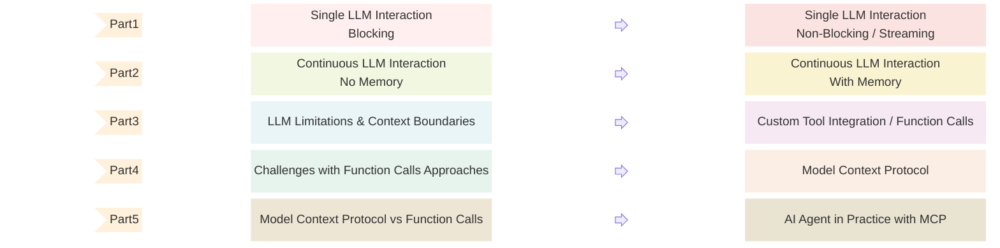
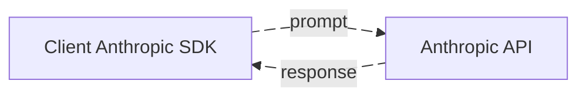

- [Introduction](#introduction)
- [What is an AI Agent?](#what-is-an-ai-agent-)
- [Single LLM Interaction - Blocking (One Input, One Output)](#a-simple-interaction-with-an-llm--one-input--one-output-)
  * [Observations](#observations)
- [Single LLM Interaction - Non-Blocking (One Input, One Output)](#improving-user-experience-with-streaming)
  * [What is Streaming?](#what-is-streaming-)
  * [Why This Still Isn't an AI Agent](#why-this-still-isn-t-an-ai-agent)
- [What's Next](#what-s-next)

## Introduction

This post is the first in a series where I'll share my personal journey of learning how to build an AI Agent from scratch using Golang. It's heavily inspired by [How to Build an Agent](https://ampcode.com/how-to-build-an-agent) by [Thorsten Ball](https://thorstenball.com/), but with a different perspective and target: evidently, a AI specific-purpose agent.

We'll begin with basic interactions with a large language model (LLM) and gradually progress toward a more complete AI Agent by incorporating conversation memory, tools, decision-making capabilities, MCP (Model Context Protocol), and more.

My goal is to share everything I've learned about how AI agents work under the hood, and to make that understanding accessible to others who are interested in the same topic.

Below you can see a general roadmap to give you an idea of what I'll be writing about.



<!--
1 introduction
2 Prerequisites
3 Environment Setup
4 what is an AI Agent?
5 Single LLM Interaction - Blocking
6 Single LLM Interaction - Non-Blocking (Streaming)
7 Dynamic Interaction (No Memory)
8 Dynamic Interaction (Memory)
9 LLM Limitations & Context Boundaries
  9.1 Knowledge Cutoff: Can't access recent information
  9.2 No External Actions: Can't send emails, make API calls, access files
  9.3 No Real-time Data: Can't get weather, stock prices, etc.
  9.4 Computational Limits: Struggles with complex math, can't run code
  9.5 No Persistence: Can't save data between sessions (beyond conversation memory)
10 Custom Tool Integration (Functions Calling & External Actions)
11 Drawbacks of Function Calls
12 Model Context Protocol
13 Function Calls vs Model Context Protocol
14 AI Agent in Practice
	14.1 Simple Tool (calculation, web request)
	14.2 Complex Tool (file operations, database queries)

```
-->
<br />

**_Disclaimer_**: I'm not an expert in AI Agents, LLMs, ML, and AI in general. This series is based on my personal learning journey, and everything I share comes from reading, research, and hands-on experimentation. Use it as a learning resource. The code examples are for educational purposes and are not production-ready.

<br />

If you see any mistakes or have suggestions for improvement, I'd really appreciate your feedback!

## What is an AI Agent?

According to Google:
> AI agents are software systems that use AI to pursue goals and complete tasks on behalf of users. They show reasoning, planning, and memory and have a level of autonomy to make decisions, learn, and adapt.

According to Anthropic:
> "Agent" can be defined in several ways. Some customers define agents as fully autonomous systems that operate independently over extended periods, using various tools to accomplish complex tasks. Others use the term to describe more prescriptive implementations that follow predefined workflows.

Both are clear explanations of what an AI Agent is. But to truly understand what's happening under the hood, let's break it all down from scratch. After exploring the concepts step by step, I'll share my own perspective. Then, you'll have enough context to define what an AI Agent really means in your own words.

## A Simple Interaction with an LLM (One Input, One Output)

Let's start with the most basic form of interaction: you send a prompt (a single message, specific instructions, query, and so on) to an LLM through the Anthropic API using the Anthropic SDK. The API responds with a generated message.



For example, you might send: `"Hello, how are you?"`

And the model might respond with: `"I'm doing well, thank you!"`

Here's what that looks like in Go:

<details>

<summary>Golang Code</summary>

```golang
// Set your API key as an environment variable named ANTHROPIC_API_KEY
// Ensure the necessary Go dependencies are installed

package main

import (
	"context"
	"fmt"
	"time"

	"github.com/anthropics/anthropic-sdk-go"
)

func main() {
	ctx := context.Background()
	message := "Hello, how are you?"
	//message := "Can you tell me about the history of AI?"
	client := anthropic.NewClient()

	// Start timing
	start := time.Now()

	outcome, err := client.Messages.New(ctx, anthropic.MessageNewParams{
		Model:     anthropic.ModelClaude4Sonnet20250514,
		MaxTokens: int64(1024),
		Messages: []anthropic.MessageParam{
			anthropic.NewUserMessage(anthropic.NewTextBlock(message)),
		},
	})

	// End timing
	duration := time.Since(start)

	if err != nil {
		fmt.Println("Error:", err)
		return
	}

	fmt.Printf("Response: %+v\n", outcome.Content[0].Text)
	fmt.Printf("Execution time: %s\n", duration)
}
```

The most relevant part of the code is:

```golang
outcome, err := client.Messages.New(ctx, anthropic.MessageNewParams{
	Model:     anthropic.ModelClaude4Sonnet20250514,
	MaxTokens: int64(1024),
	Messages: []anthropic.MessageParam{
		anthropic.NewUserMessage(anthropic.NewTextBlock(message)),
	},
})
```
Where explicitly setting the model and parameters is crucial for controlling the behavior of the AI agent.

</details>

When you run the previous code, the response might look like:


Let's try sending another message: `"Can you give me a summary about the history of AI?"`

Executing the code will give you something like:


### Observations

1. **Response time varies significantly**: The first example takes approximately 1.5 seconds, while the second takes approximately 10 seconds. This variation depends on the complexity of the response.

2. **Verbose responses**: In the first example, the response is more verbose than a simple "I'm doing well, thank you!" This is because the model is designed to be helpful and informative, but it can be adjusted by changing the prompt or model parameters (e.g., temperature, top_p, etc.).

3. **Blocking behavior**: During this process, the execution appears to freeze until the response is received, especially in the second example where the delay is more evident. This creates a poor user experience and gives the impression that the system is unresponsive.

<br />

In both examples, we see a simple interaction: `input → output`
So, is this simple interaction considered an AI Agent? You might think so, after all, you're interacting with a LLM over the Anthropic API, right? but, the short answer is **absolutely not!**

**Why not?** Because the code we've used so far only handles a single, stateless interaction with no ongoing dialogue and it is blocking. Additionally, it doesn't:
- Retain any previous messages in memory
- Take actions on your behalf
- Interact with external systems or tools
- Understand or pursue goals
- Make decisions based on context or requirements

This basic interaction is not sufficient to qualify as an AI agent. **Here's a simple test that proves this point:**

Try sending the message: `"What time is it now?"`

The response will be something like: `"I don't have access to real-time information, so I can't tell you the current time. To find out what time it is, you could..."`

This demonstrates a fundamental limitation: the system can't perform actions or access external information (core requirements for any useful AI agent).

## Improving User Experience with Streaming

Before we add agent-like capabilities, let's address the blocking behavior issue. This won't make our system an AI agent, but it will make it feel more responsive and interactive, qualities that any good agent should have. What it means?


Seems like a good start with an acceptable user experience, right?

### What is Streaming?

Think of streaming like talking to someone who starts speaking as soon as they have an idea, instead of waiting to plan out everything they’re going to say. They share their thoughts bit by bit, as they come, until they’ve said everything.

In our LLM context, instead of waiting for the entire response to be generated before displaying it, streaming allows us to receive and display the response as it's being generated, word by word or chunk by chunk.

Here's the refactored code using streaming:

<details>

<summary>Streaming Implementation</summary>

```golang
package main

import (
	"context"
	"fmt"
	"os"

	"github.com/anthropics/anthropic-sdk-go"
)

func main() {
	ctx := context.Background()

	if len(os.Args) < 2 {
		fmt.Println("Usage: go run main.go \"Your message here\"")
		return
	}

	message := os.Args[1]
	client := anthropic.NewClient()

	fmt.Printf("You: %s\n\nAssistant: ", message)

	stream := client.Messages.NewStreaming(ctx, anthropic.MessageNewParams{
		Model:     anthropic.ModelClaude4Sonnet20250514,
		MaxTokens: int64(1024),
		Messages: []anthropic.MessageParam{
			anthropic.NewUserMessage(anthropic.NewTextBlock(message)),
		},
	})

	for stream.Next() {
		event := stream.Current()
		if event.Type == "content_block_delta" {
			if delta, ok := event.ContentBlockDelta.Delta.(anthropic.TextDelta); ok {
				fmt.Print(delta.Text)
			}
		}
	}

	if err := stream.Err(); err != nil {
		fmt.Printf("\nError: %v\n", err)
		return
	}

	fmt.Println("\n")
}
```

</details>

This streaming implementation provides immediate feedback and a more natural, conversational feel. As you can see in the third image, the response appears progressively, making the interaction feel more alive and responsive.

### Why This Still Isn't an AI Agent

While streaming improves the user experience dramatically, our system still lacks the core characteristics of an AI agent:
- **No memory**: Each interaction is independent
- **No tools**: Can't perform actions beyond generating text
- **No goal-oriented behavior**: Doesn't work toward specific objectives
- **No decision-making**: Doesn't choose between different courses of action

In the next parts of this series, we'll add these missing pieces step by step that will transform our single LLM interaction into a true AI agent.

## What's Next

In the upcoming posts, we'll explore:

1. **Continues LLM Interaction - No Memory** - Making a fluent conversation with the LLM 2. **Continues LLM Interaction - With Memory** - Making a fluent conversation with the LLM remembering previous interactions
3. **LLM Limitations & Context Boundaries** - Understanding the limitations of the previous interactions
4. **Custom Tools / Function Calls** - Adding to LLM the ability to perform actions with external systems
5. **Challenges with Function Calls Approaches**
6. **Model Context Protocol (MCP)**
7. **Model Context Protocol vs Function Calls**
8. **AI Agent in Practice with MCP**

Each step will bring us closer to a system that truly deserves the title "AI Agent."
